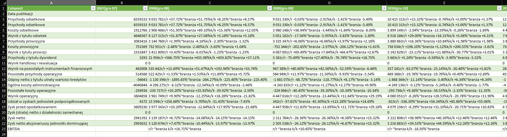
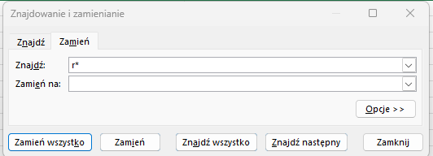
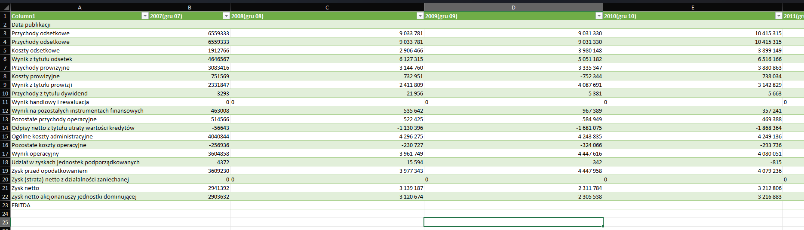

# 1 TRICK
## DATA CONTAINS UNNECESSERY CHARACTERS THAT WE WANT TO REMOVE

## WE WILL USE THE "FIND AND REPLACE" FUNCTION (CTRL + H)
### WE WANT TO REMOVE ALL CHARACTERS AFTER "/" WE CAN DO THAT BY TYPING "r*" 

## THAT'S THE RESULT!

# 2 TRICK
